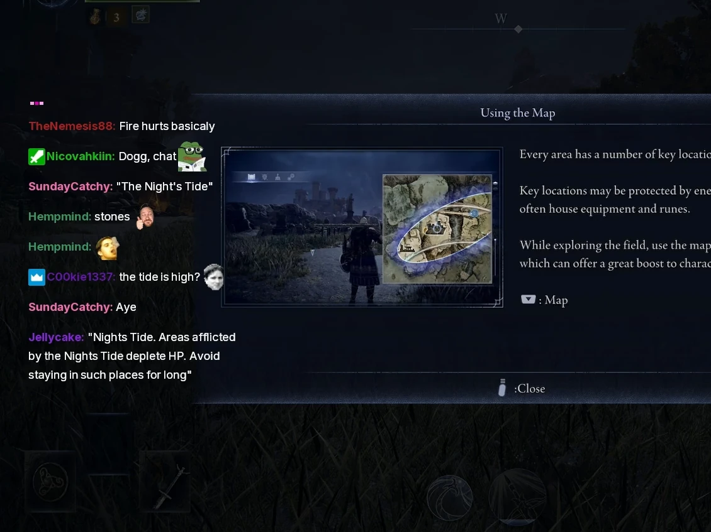

# twitch-vod-chat-overlay
Create Twitch VODs with simple chat overlay using [TwitchDownloader](https://github.com/lay295/TwitchDownloader) and [FFmpeg](https://ffmpeg.org/).

## Prerequisites

Download and extract [TwitchDownloader(https://github.com/lay295/TwitchDownloader), have [FFmpeg](https://ffmpeg.org/) installed.
Download the latest release of this script from [releases](https://github.com/thatsafy/twitch-vod-chat-overlay/releases) to the TwitchDownloader directory.

## How to run

Make the script executable with 'chmod +x twitchvods.sh'.

Run the script: ./twitchvods -i \<vod-id\> -o \<output-file\>  
Additionally can use -b and -e to specify beginning and/or end times.  
./twitchvods -i \<vod-id\> -o \<output-file\> -b \<begin-time\> -e \<end-time\> 

### Batch rendering
With the batchdl script you can use an input file from which to read and download plus render multiple videos.  
Each line in the input file should have:  
-i \<vod-i\> -o \<output-file\> [-b \<begin-time\>] [-e \<end-time\>]  
where -b and -e are optional flags.  

Run the batch render script: ./batchdl \<input-file\>  

The main script will download the chat in json format for the vod and then render it to mp4 format while downloading the main Twitch vod file.  
It will then use FFmpeg to overlay the chat mp4 file over the video.  

Script will create a subdirectory for the output files, $FILENAME/$FILENAME.mp4 + downloaded files.    

## Planned features
- Custom output directory?  
